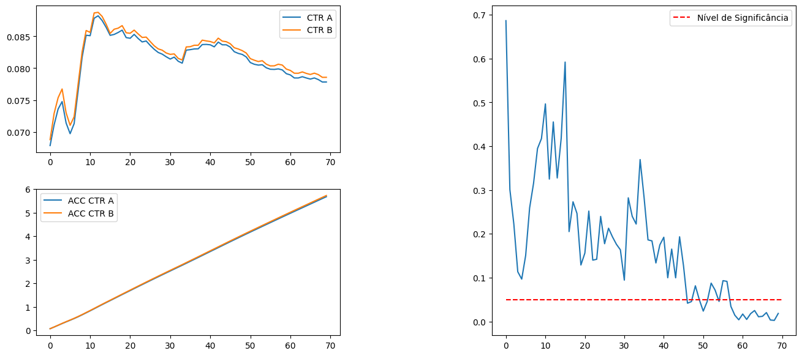
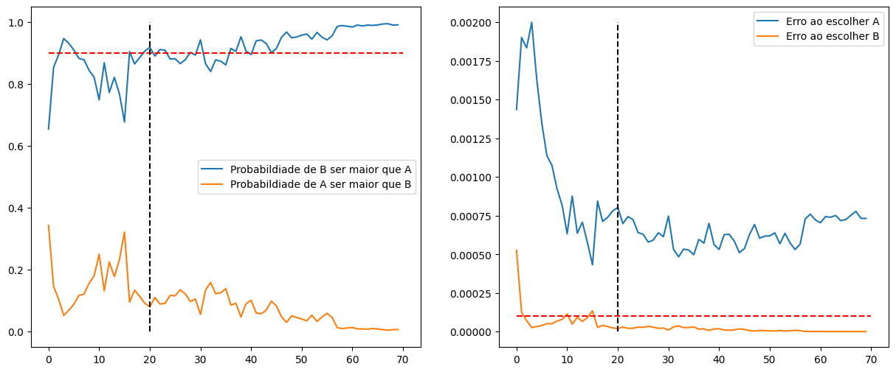

# Teste A/B Bayesiano

# Introdução

Esse é um projeto end-to-end de Data Science, focado na especilização com Teste A/B. No qual identificamos qual página apresenta maior sucesso na captura de leads, trazendo essa resposta no menor tempo possível. Para isso o teste A/B Bayesiano foi utilizado, juntamento com concieto do Multi Armed Bandit.

O conjunto de dados para esse estudo será criado de forma sintética.

Esse projeto faz parte da "Comunidade DS", que é um ambiente de estudo que promove o aprendizado, execução, e discussão de projetos de Data Science.

### Plano de Desenvolvimento do Projeto de Data Science

Esse projeto foi desenvolvido seguindo o método CRISP-DS(Cross-Industry Standard Process - Data Science). Essa é uma metodologia capaz de transformar os dados da empresa em conhecimento e informações que auxiliam na tomada de decisão. A metodologia CRISP-DM define o ciclo de vida do projeto, dividindo-as nas seguintes etapas:

- Entendimento do Problema de Negócio
- Coleção dos Dados
- Limpeza de Dados
- Análise Exploratória dos Dados
- Preparação dos Dados
- Modelos de Machine Learning.
- Avaliação dos Resultados do Modelo e Tradução para Negócio.
- Modelo em Produção

Observação: Como esse não é um projeto com uso de Machine Learning, os ciclos do CRISP-DM foram usados no contexto do Teste A/B.

### Planejamento

- [1. Descrição e Problema de Negócio](#1-descrição-e-problema-de-negócio)
- [2. Base de Dados e Premissas de Negócio](#2-base-de-dados-e-premissas-de-negócio)
- [3. Estratégia de Solução](#3-estratégia-de-solução)
- [4. Frequentista vs Bayesiano](#4-frequentista-vs-bayesiano)
- [5. Teste Bayesiano](#5-teste-bayesiano)
- [6. Multi Armed Bandit](#6-multi-armed-bandit)
- [7. Resultados de Negócio](#7-resultados-de-negócio)
- [8. Conclusão](#8-conclusão)
- [9. Aprendizados e Trabalhos Futuros](#9-aprendizados-e-trabalhos-futuros)

# 1. Descrição e Problema de Negócio

### 1.1 Descrição

A empresa iSketch, localizada em São Paulo, fabrica e disponibiliza um software com foco no desenvolvimento 3D de projetos para construção civil, como forma de prototipagem de grandes projetos.

Para usar o software, o cliente precisa adquirir uma licença de uso que se renova anualmente.

Uma das melhores estratégias de aquisição de clientes da iSketch é a captura do email dos clientes em troca de uma Newsletter com conteúdos semanais
sobre construção civil. A assinatura da newsletter permite começar um relacionamento entre a iSketch e as pessoas, a fim de mostrar as vantagens de utilizar o software para criar protótipos de construções civis.

Portanto, a melhoria de conversão da página de captura de email, ofertando a newsletter em troca, é crucial para o crescimento do número de clientes.

Sendo assim, o coordenador de Marketing da empresa pediu ao time de Designers que criassem uma nova página de captura de email com uma pequena modificação nas cores do botão de “sign-up”, a fim de aumentar a conversão da página.

O time de Designers criaram uma página com o botão de “sign-up” vermelho para ser testada contra a página atual que possui o botão de “sign-up” azul. O coordenador de Marketing tem pressa em testar a nova página, pois a empresa
vem adquirindo poucos clientes nas últimas semanas e isso pode comprometer o faturamento anual da empresa.

O time de Cientistas de Dados da iSketch foi acionando com a missão de testar a nova página de captura de email o mais rápido possível. A primeira idéia foi planejar um experimento de teste A/B entre as duas páginas por um período de 7 dias, para concluir a efetividade da mudança da cor do botão. Porém, o coordenador de Marketing categoricamente disse ao time de dados que não poderia esperar 7 dias e solicitou que concluíssem em menos tempo.

### 1.2 Problema de Negócio

O papel do Cientista de Dados foi ajudar no projeto de validação do novo layout da página, junto com o time de Marketing, a fim de ajudar a avaliação da nova página e captura. O entregal é responder a seguinte pergunta:

**- A nova página apresenta uma conversão maior ou pior que a página atual?** 
**A resposta precisa vir o mais rápido possível (menos de 7 dias).**

# 2. Base de Dados e Premissas de Negócio

## 2.1 Base de Dados

A base de dados será gerada de forma sintética ao criar duas páginas fictícias e simular clicks nas páginas, gerando assim um dataset com os seguintes atributos:

| **Atributos** | **Descrição**                                                              |
| ------------- | -------------------------------------------------------------------------- |
| click         | 1: Clique na página 0: Sem clique na página                                |
| visit         | 1: Visita na página                                                        |
| group         | Definição do grupo do usuário entre, grupo de tratamento ou grupo controle |

## 2.2 Premissas de Negócio

Para realizar esse projeto as seguintes premissas de negócio foram adotadas:

- A coluna "visit" sempre terá o valor 1, considerando que o usuário entrou na página. Essa coluna é importante ser setada para o cálculo do teste.
- No problema diz que a resposta precisa ser entregue em até 7 dias, mas não podemos simular quantos usuários entram por dia, consideraremos cada entrada de usuário como um dia na hora de plotar os gráficos, apenas para representar a passagem do tempo.
- De qualquer forma, para resolver esse problema de entregar o mais rápido possível, o Teste A/B Bayesiano será usado, juntamento com o MAB, com o intuito de controlar a amostragem das páginas.

# 3. Estratégia de Solução

A estratégia de solução foi a seguinte:

### Passo 01. Entendimento da diferença entre os tipos de teste de hipóteses

Nesse passo adicionado antes dos demais, com o intuito de gerar o entendimento sobre o motivo de escolher o teste Bayesiano ao invés do Frequentista para esse tipo de problema onde o tempo de resolução do teste de hipótese é demasiadamente importante.

Dessa forma, com exemplo prático e dados fictícios esse conceito foi passado.

### Passo 02. Design do Experimento

Esse passo foi usado para desenhar e planejar a criação dos códigos e como eles se interligam.

### Passo 03. Criação das páginas e dos visitantes

Para aplicar o teste, foi preciso criar as duas páginas que seriam avaliadas, simular o deploy das mesmas, juntamente com a aplicação de visitantes nas mesmas.

### Passo 04. Aplicação e avaliação do Teste Bayesiano

Com as páginas prontas, foi realizada a simulação dos usuários entrando nas páginas e clicando (ou não) no botão que indicava a conversão do entrante.

Isso gerou os dados sintéticos que foram utilizados para a realização do teste bayesiano e a tomada de decisão.

### Passo 05. Aplicação do MAB

A metodoligia utilizado foi adaptada para a aplicação do MAB, que após de ser validado foi aplicado com a avaliação do teste bayesiano.

# 4. Frequentista vs Bayesiano

Os testes A/B são usados para comparar diferentes versões de um produto, site ou estratégia e determinar qual é mais eficaz. Existem dois principais métodos estatísticos para analisar esses testes: **Frequentista** e **Bayesiano**.

O método frequentista baseia-se na teoria da frequência de eventos e usa métricas como **valor-p (p-value)** para determinar se há uma diferença estatisticamente significativa entre as versões testadas. Algumas características desse método:

- Requer um **tamanho de amostra pré-definido**.
- Não pode ser interrompido antes sem comprometer os resultados.
- Baseia-se em testes tradicionais de hipótese para determinar significância estatística.

O método bayesiano usa probabilidade para atualizar crenças com base em novos dados, permitindo uma análise mais flexível. Algumas características desse método:

- Não exige um tamanho fixo de amostra, permitindo decisões mais rápidas.
- Fornece uma **probabilidade direta** de uma variação ser melhor que a outra, tornando a interpretação mais intuitiva.
- Permite uma abordagem **mais adaptável e contínua** na tomada de decisão.

Dessa forma temos:

| Método           | Características                                                                               |
| ---------------- | --------------------------------------------------------------------------------------------- |
| **Frequentista** | Análise rígida, requer tamanho de amostra fixo, usa p-value para decisão.                     |
| **Bayesiano**    | Análise flexível, não exige tamanho fixo de amostra, fornece probabilidade direta de sucesso. |

O método **frequentista** é mais tradicional e baseado em testes estatísticos clássicos, enquanto o **bayesiano** é mais adaptável e permite decisões contínuas com base em novas informações. Assim, o mesmo conjunto de dados foi aplicado com ambos os testes com o intuito de exemplificar essa explicação.

## 4.1 Frequentista

Dessa forma, aplicando um conjunto de dados com quantidade de visitas e cliques em duas páginas, em um Teste A/B com o intuito de descobrir qual página apresenta maior conversão. Podemos observar o seguinte resultado com o teste Frequentista.

No gráfico da esquerda em cima é possível observar que desde os primeiros dias o CTR da página B é levemente maior que o CTR da página A e com o passar dos dias, essa diferença aumenta.
E corroborando com isso, vemos no gráfico da esquerda embaixo que se somassemos o CTR das duas páginas, o da página B continua levemente maior que o da página A.

Contudo, a diferença entre os CTRs da páginas não é gritante e por isso, para definir qual página é melhor, o foi aplicado e para a avaliação observamos o p-valor que é mostrado no gráfico da direita.
Observa-se que o p-valor é bem alto nos primeiros dias, devido a pouca quantidade de dados que temos até o dia em questão, juntamento com o fato da diferença entre as conversões ser relatividamente pequena.

Até o dia 58 não era possível tirar uma conclusão, mesmo que o CTR da página B fosse maior que a da página A, não haviam amostras o suficiente para provar que isso era estatísticamente significativo. A partir desse dia, observa-se que o p-valor se estabelece como menor que 0,05. Assim, **levando 58 dias para provar que a página B apresenta maior conversão que a página A**.

## 4.2 Bayesiano

Podemos observar o seguinte resultado com o teste Bayesiano.

Ao invés de trabalhar com o p-valor, trabalhamos com a probabilidade do CTR de B ser maior do que de A e com o erro atrelado a fazer essa escolha.

Observando o gráfico da esquerda, vemos que desde o início a probabilidade de B ser maior do que A é maior que a probabilidade de A ser maior que B. Contudo, a partir do dia 20, a probabilidade de B ser maior que A passa pela primeira vez dos 90%.

Ao mesmo tempo, no gráfico da direita é possível ver o erro atrelado a fazer essa escolha. E no dia 20 é visível que já faziam 3 dias que o erro atrelado ao escolher B era menor que 0,0001. Isso nao significa que não há chances de A ser melhor, contudo, seria muito difícil isso acontecer. Assim, **como a probabilidade de B ser maior que A passa de 90% e o erro atrelado ao fazer essa escolha é menor que o treshold definido, podemos escolher a página B como melhor que a A**.

Importante ressaltar que isso não prova que a **conversão da página B é estatistamente maior que a conversão da página B**. Entretanto, os dados mostram que a **chance disso acontecer são muito altas**. Assim, com o método Bayesiano a decisão foi tomada no dia 20, **38 dias a menos que o método frequentista**, e isso pode significar que a empresa poderia mostrar o melhor site nesse período e com isso **otimizar o seu ganho**.

# 5. Teste Bayesiano

## 5.1 Planejamento do teste

## 5.2 Resultados

# 6. Multi Armed Bandit

A seguir daremos definições dos parâmetros e quais valores foram usados.

# 7. Resultados de Negócio

Respondendo as perguntas de negócio:

**Qual a melhor forma de pagamento: Preenchimento Manual ou Automático do formulário de dados do cartão de crédito?**

Através do teste de hipóteses podemos provar que apesar de uma boa ideia, o Preenchimento Manual continua sendo a melhor forma para preencher os dados de cartão de crédito. Observamos que a média de valor gasto com compras nesse tipo de preenchiemnto é 10% maior que a média do valor gasto no preenchimento manual.

Com isso, a hipótese é que esse novo tipo de preenchimento não foi bem recebido pelos usuários, para saber exatamento o motivo seria interessante fazer um teste de usuabilidade.

Além disso, descobrimos que variáveis como gênero e device não influenciam na média de valor gasto e de compras para ambos os tipos de preenchimento.

Por fim, em alguns lugares observamos uma preferência no tipo de preenchimento, como no México, que apresentou média de valor gasto 10% maior no preenchimento automático. Em contrapartida, na França de encontram os principais ofensores so novo tipo de preenchimento, onde a média de valor gasto de de compras é 10% menor no novo método.

# 8. Conclusão

Nesse projeto, foram realizadas todas as etapas necessárias para a implementação de um projeto completo de Data Science focado na utilização do Teste A/B. Foi utilizado o método de gerenciamento de projeto chamado CRISP-DM/DS e obteve-se um desempenho satisfatório em compreender a utilização do teste A/B e aplicar em um problema real.

Tendo em vista os resultados, o projeto alcançou seu objetivo de fazer o teste e provar para a empresa de forma estatística que o nov tipo de preenchimento não foi o esperado.

# 9. Aprendizados e Trabalhos Futuros

**Aprendizados**

- Compreensão e aplicação do Teste A/B com médias.
- Conceitos estatísticos e parâmetros com teste de hipóteses.

**Trabalhos Futuros**

- Aprofundar na análise do que influencia mais na compra ao invés do preenchimento do formulário.
- Aplicar os testes nos páises com divergências maiores, segregando ainda mais, como com device e gênero.
